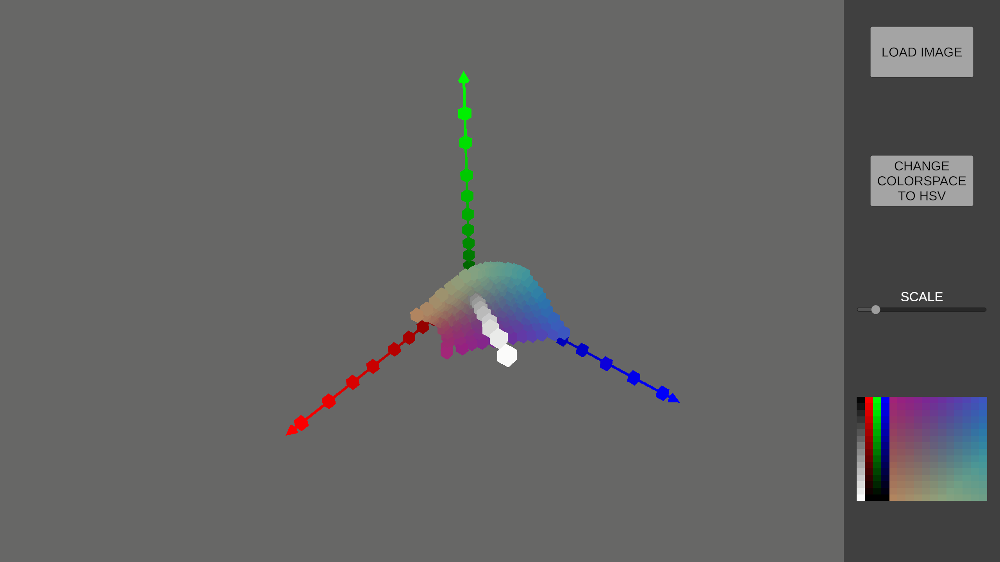
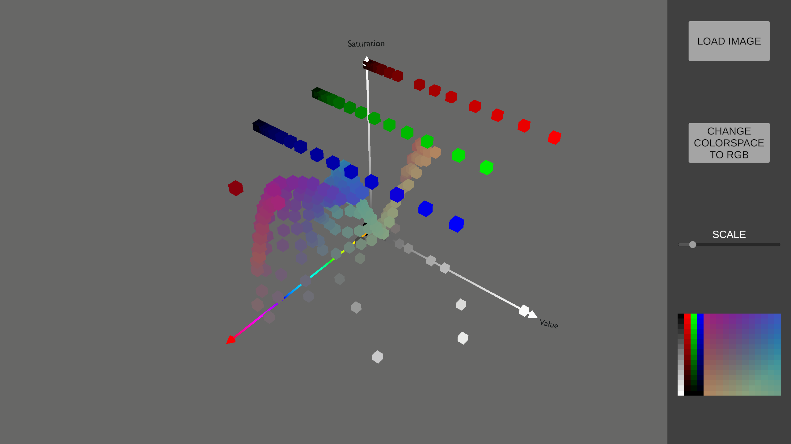
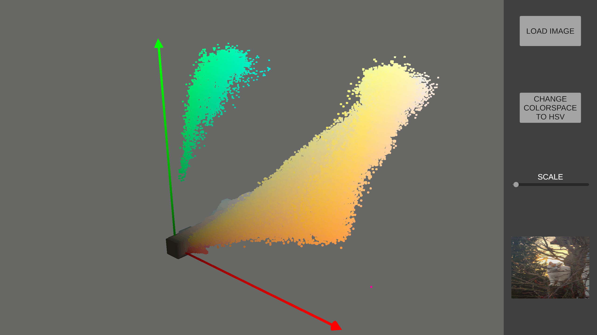
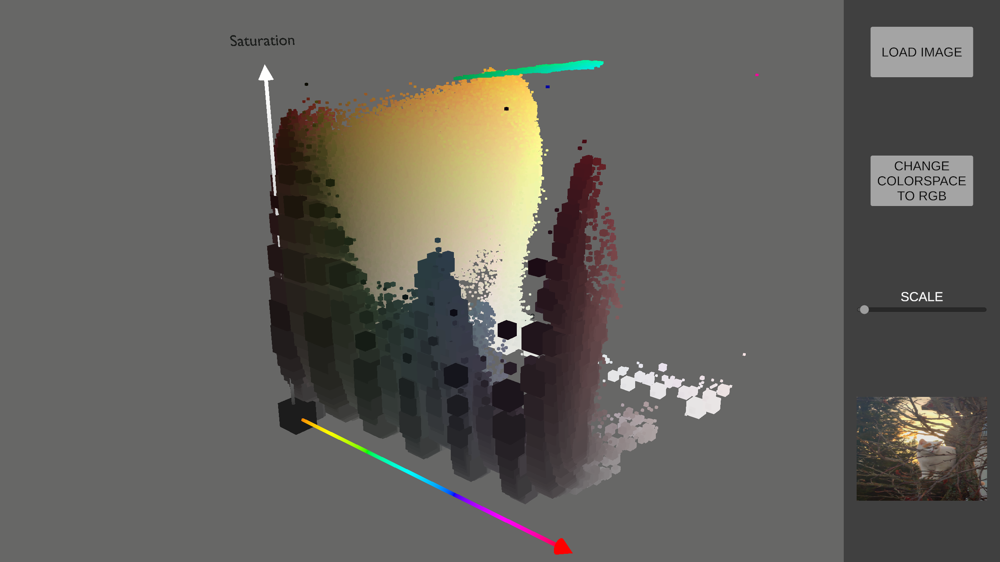

<a id="readme-top"></a>

<!-- ABOUT THE PROJECT -->
## About The Project
This project is an application developed in Unity to visualize the pixel of an image in the RGB and in the HSV colorspace in 3D. The image processing is happening completly on the GPU and the resulting data are GPU instanced meshes. 

<div align="center">
    
  </div>
1. RGB test image in RGB space
<br/> 
<br/> 
<div align="center">
    
</div>
1. RGB test image in HSV space
<br/> 
<br/> 
<div align="center">
    
</div>
1. Realife test image in RGB space
<br/> 
<br/> 
<div align="center">
    
</div>
1. Realife test image in HSV space
<br/> 
<br/> 


## Built With
The project was created using the Unity Engine 3D and a file explorer plugin.

* Engine
  ```
  Unity 2022.3.58f1 URP
  ```
* <a href="https://github.com/gkngkc/UnityStandaloneFileBrowser">File Explorer Plugin</a>
  ```
  UnityStandaloneFileBrowser
  ```


<!-- GETTING STARTED -->
## Getting Started
If you want to work on the project yourself you need to do the following:

1. Install the Unity engine with the correct verion on your machine. 

2. Clone this repository.
   
3. In Unity Hub add a project and locate your cloned repository.  

<!-- USAGE EXAMPLES -->
## Usage

### Installation
If you just want to use the application, download the correct version for your OS from <a href="https://github.com/sebastianregelmann/3D-Color-Space-Visualizer/releases">here</a> and run the application. 

In <a href="Assets/Test_Images">this folder</a> are some example images to test the application. 
1. Grey scale colors
   
2. RGB fade and HUE fade
   
3. All possible RGB colors
   
4. Real life example image

### Features
1. Load an image into the app and see the pixels in 3D colorspace

2. Change the colorspace between RGB and HSV and see the difference

3. Change the scale of the datapoints to your liking.

4. Bigger datapoints show multiple Pixels with the same color.

5. The camera can be used in the following way: 
  
    Look around: Right mouse button

    Move the camera: Scroll wheel button
  
    Zoom in/out: Scroll wheel


### Details

1. Coordinate Systems: 
   
   For the RGB color space the axis are colored in the corespinding color. 
   For the HSV color space the hue axis is from 0 (red) to 0.5 (turquoise) to 1 (red) and the value ans saturaion are 0 (black) to 1 (white). 

2. Data Points: 
   
   For pixels that have the same color the number of pixels with the same color are counted. The scale of the data point depends on the users set scale and the number of pixels with the same color. The scale increases logarithmic. So double the size means 10 times more pixels with the same color.
<br/> 

# Code
## Color Counting 
To get a count of pixels for each color the GPU runs three kernels. 
1. Initialization
   ```cpp
    [numthreads(8,8,8)]
    void InitRGBMap (uint3 id : SV_DispatchThreadID)
    {
        uint3 index = id.xyz;
        if(index.r >= 255 || index.g >= 255 || index.b >= 255)
        {
            return;
        }

        //Convert thrad index into a linear index based on the RGB Values
        uint colorIndex = index.b * 255 * 255 + index.g * 255 + index.r;

        float4 color = float4(float(index.r) / 255.0, float(index.g) / 255.0, float(index.b) / 255.0, 1.0);
        float3 position = color.rgb;
        float count = 0;

        Data data;
        data.color = color;
        data.position = position;
        data.count = count;

        _RGBMap[colorIndex] = data; //Set Data
        _RGBCounts[colorIndex] = 0; // Reset count
    }
   ```
This kernel fills the `_RGBMap` buffer with an empty data point and the `_RGBCounts` buffer with a value of 0.

2. Read image and write to count buffer
   ```cpp
    [numthreads(32,32,1)]
    void WriteToRGBMap (uint3 id : SV_DispatchThreadID)
    {
        uint2 index = id.xy;

        if(index.x >= _Width || index.y >= _Height)
        {
            return;
        }

        //Get the color from the Texture
        float3 color = _Texture[index.xy].rgb;

        //Get the index from the color
        int r = int(ceil(color.r * 255));
        int g = int(ceil(color.g * 255));
        int b = int(ceil(color.b * 255));

        int colorIndex = b * 255 * 255 + g * 255 + r;

        //Atomic Add to increase the counter of _RGBMap by one at the colorIndex
        uint tmp;
        InterlockedAdd(_RGBCounts[colorIndex], 1, tmp);
    }

   ```
This kernel reads the provided image and converts the read color to an index for the RGB map. Than it atomicly adds that index in the `_RGBCounts` buffer to count how manny of pixels have the same color


3. Read image and write to count buffer
   ```cpp
    [numthreads(8,8,8)]
    void FilterRGBMap (uint3 id : SV_DispatchThreadID)
    {

        uint3 index = id.xyz;
        if(index.r >= 255 || index.g >= 255 || index.b >= 255)
        {
            return;
        }

        //Convert thrad index into a linear index based on the RGB Values
        uint colorIndex = index.b * 255 * 255 + index.g * 255 + index.r;

        Data data = _RGBMap[colorIndex];
        uint count = _RGBCounts[colorIndex];

        //If data is not Present Skip it
        if(count <= 0)
        {
            return;
        }

        //Save the unique Data
        Data unique;
        unique.color = data.color;
        unique.position = data.position;
        unique.count = count;

        _UniqueRGB.Append(unique);
    }

   ```
This kernel reads every entry in the `_RGBCounts` buffer and if the entry has a value greater than 1, it appends a data elemnt to the `_UniqueRGB` buffer.

<!-- LICENSE -->
# License

Distributed under the MIT License. See <a href="https://github.com/sebastianregelmann/3D-Color-Space-Visualizer">`LICENCE.txt`</a> for more information.

<p align="right">(<a href="#readme-top">back to top</a>)</p>
